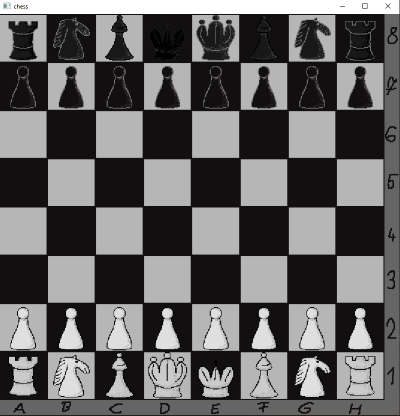
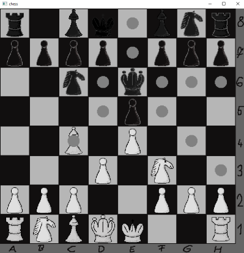
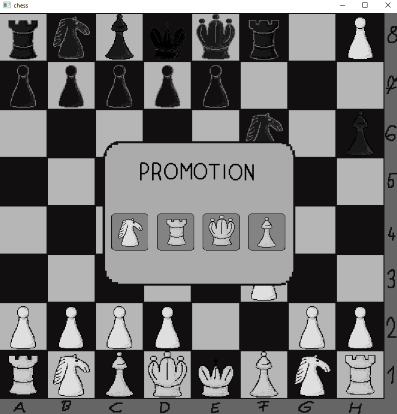
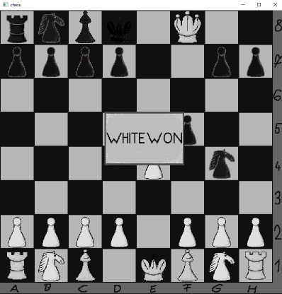
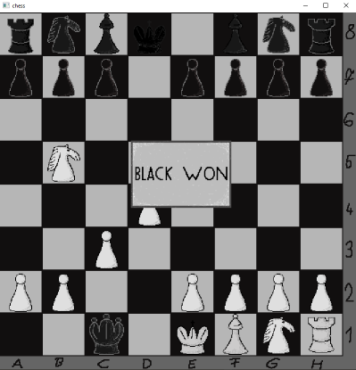

### Description:
- This is my first-ever solo project, developed in C++ using the SFML library. 
- It may still be a bit messy, but it represents my first step into creating something entirely on my own.

### Goal:
- Create a fully functional chess game.
- To deepen my understanding of C++. When I began this project, my knowledge of the language was minimal.

### Screenshots:

  
  
  
  
  

